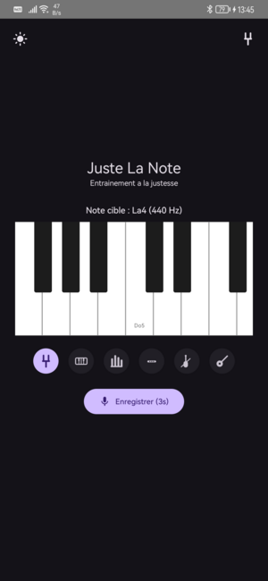
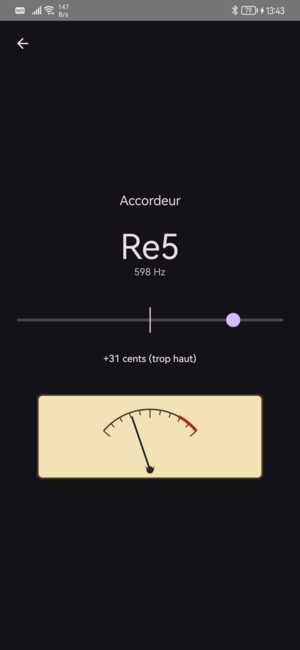
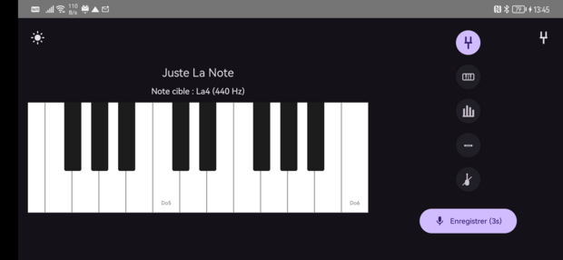

# Juste La Note

Application Android d'**entraînement à la justesse vocale** et d'**accordage d'instrument**.
On choisit une note sur un clavier de piano, on l'écoute (diapason ou instrument
réel), on la chante, et l'app mesure l'écart en cents. Un mode accordeur analyse
la hauteur en temps réel avec un vu-mètre analogique.

<p align="center">
  
  &nbsp;&nbsp;&nbsp;
  
</p>
<p align="center">
  
</p>

## Fonctionnalités

- **Clavier de piano** (Do2–Do6) pour choisir et écouter la note cible, **polyphonique** : taper plusieurs touches les fait sonner ensemble.
- **Instruments** : diapason (sinus pur) plus des timbres réels — piano, orgue, flûte, violon, guitare — joués par le **synthétiseur General MIDI intégré** d'Android. Boutons-icônes dédiés.
- **Test vocal** : enregistre 3 s au micro, détecte la hauteur (algorithme **YIN**) et affiche le verdict. La comparaison **ignore l'octave** (chanter le bon nom de note dans sa propre tessiture est compté juste — pratique pour les voix graves), avec l'octave réelle indiquée et des **conseils vocaux** (« Soulevez le palais » / « Abaissez le larynx »).
- **Mode accordeur** : analyse en temps réel, note la plus proche, écart en cents (aiguille lissée) et **vu-mètre analogique vintage**. Détecte jusqu'aux cordes graves (~31 Hz, basse 5 cordes).
- **Thème clair/sombre** (suit le système, bascule manuelle) et **mise en page adaptative** portrait/paysage.

## Construire et lancer

Projet Gradle standard (le SDK Android est lu depuis `local.properties`, non versionné) :

```bash
./gradlew assembleDebug      # construire l'APK de debug
./gradlew installDebug       # installer sur l'appareil/émulateur connecté
./gradlew testDebugUnitTest  # tests unitaires JVM
./gradlew lint               # analyse statique Android
```

Lancer un test précis :

```bash
./gradlew :app:testDebugUnitTest --tests "com.justelanote.app.PitchDetectorTest"
```

L'app demande la permission **micro** (`RECORD_AUDIO`) au premier enregistrement / à l'ouverture de l'accordeur.

## Architecture

Tout est dans le package `com.justelanote.app`. Pas de DI ni de ViewModel : l'état de l'UI est porté par les composables (`remember` / `mutableStateOf`). Le traitement audio est du **DSP Kotlin pur**, sans bibliothèque audio tierce.

| Fichier | Rôle |
| --- | --- |
| `MainActivity.kt` | Activité unique, navigation entraînement ↔ accordeur, écran `PitchTrainerScreen`, thème, permission micro |
| `PianoKeyboard.kt` | Clavier de piano scrollable (touches blanches/noires, surlignage des notes en cours) |
| `NotePlayer.kt` | Lecture **polyphonique** : `AudioTrack` (sinus) pour le diapason, `MediaPlayer` + synthé MIDI pour les instruments |
| `MidiBuilder.kt` | Génère en mémoire un fichier MIDI (SMF) jouant une note avec un programme General MIDI |
| `Instrument.kt` | Définition des instruments (programme GM + icône) |
| `NoteLibrary.kt` | Tables de notes (tempérament égal, La=440), note la plus proche, calcul des cents et du décalage d'octave |
| `PitchDetector.kt` | Détection de hauteur **YIN** (CMNDF + interpolation parabolique), médiane sur fenêtres glissantes |
| `AudioRecorderHelper.kt` | Enregistrement micro ponctuel (test vocal de 3 s) |
| `TunerEngine.kt` | Analyse micro **en continu** pour l'accordeur (fréquence + niveau d'entrée) |
| `TunerScreen.kt` | UI de l'accordeur : note, jauge de cents lissée, vu-mètre vintage dessiné au `Canvas` |

Les notes sont en tempérament égal et coïncident avec les numéros MIDI : jouer un instrument revient donc à jouer la note MIDI correspondante, et la justesse de référence est exacte.

## Tests

Tests unitaires JVM (sans appareil) :

- `NoteLibraryTest` — comparaison octave-agnostique et décalage d'octave.
- `PitchDetectorTest` — détection de sinusoïdes synthétiques, des graves (Si0 ~31 Hz, Mi1) aux aigus.

## Pile technique

Kotlin · Jetpack Compose (Material 3) · AGP 9.2.1 · Kotlin 2.2.10 · `compileSdk` 36 · `minSdk` 24. Synthèse audio via `AudioTrack` / `MediaPlayer` (synthé Sonivox intégré) et captation via `AudioRecord`.
